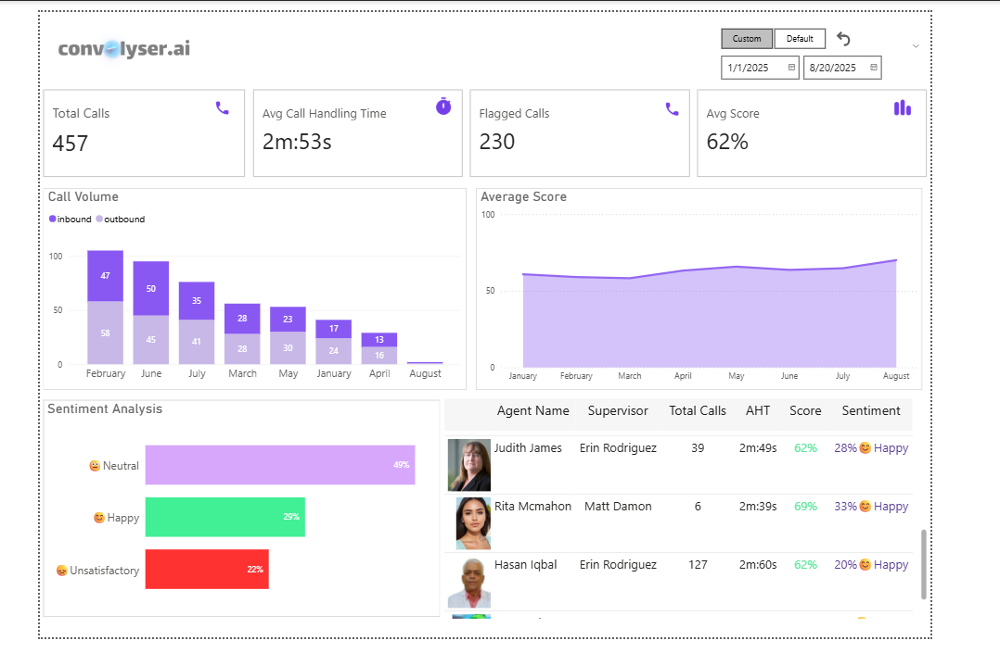
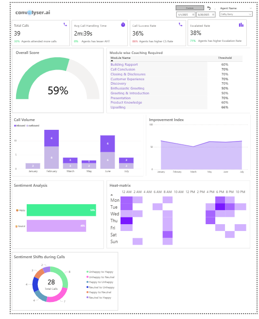

# Call Center Analytics Dashboard

## Overview
This project showcases an **interactive call center analytics dashboard** (using sample data) built during my internship at **YBrantWorks**. The dashboard provides **insights** into call performance, sentiment analysis, agent productivity, and coaching opportunities.  

The goal is to empower managers and team leads to **improve customer satisfaction, optimize agent efficiency, and identify training needs** based on data-driven evidence.

---

## Real-World Problem
Call centers generate **massive volumes of unstructured data** through daily conversations. Without effective analytics, supervisors struggle to:
- Track agent performance at scale
- Identify unhappy customers early
- Spot coaching opportunities
- Improve call success rates

This dashboard bridges that gap by turning raw call data into actionable insights.

---

## Key Features
1. **KPI Tracking** – Total Calls, Avg. Handling Time, Flagged Calls, Success Rates, Escalation Rates.  
2. **Sentiment Analysis** – Categorizing customer sentiment into *Happy, Neutral, Unsatisfactory*.  
3. **Trend Analysis** – Call Volume and Score trends over time for performance monitoring.  
4. **Agent-Level Insights** – Per-agent breakdown (calls, AHT, score, sentiment).  
5. **Heatmaps** – Visualizing call activity by hour/day to optimize staffing.  
6. **Coaching Module** – Highlights which communication skills need improvement.  
7. **Sentiment Shifts During Calls** – Detects when customer mood changes, helping flag at-risk interactions.  

---

## Tools & Tech Used
- **Power BI** – For dashboard development and visualization  
- **DAX & Power Query** – Custom calculations and transformations (data cleaning) 

---

## Results
- Reduced **manual performance tracking**  
- Enabled **data-driven coaching** by highlighting skill gaps per agent  
- Improved **customer satisfaction insights** through sentiment analysis  
- Delivered a dashboard that **executives could use immediately** to monitor performance
- 
---

## 📷 Dashboard Snapshots
### Overall Team Dashboard

### Individual Agent Dashboard

